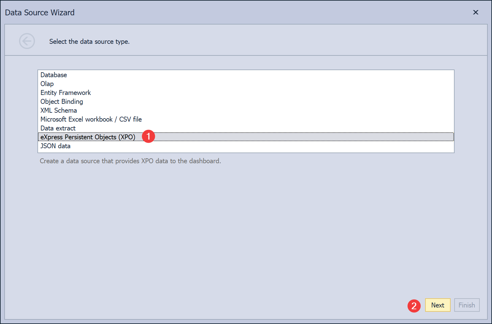
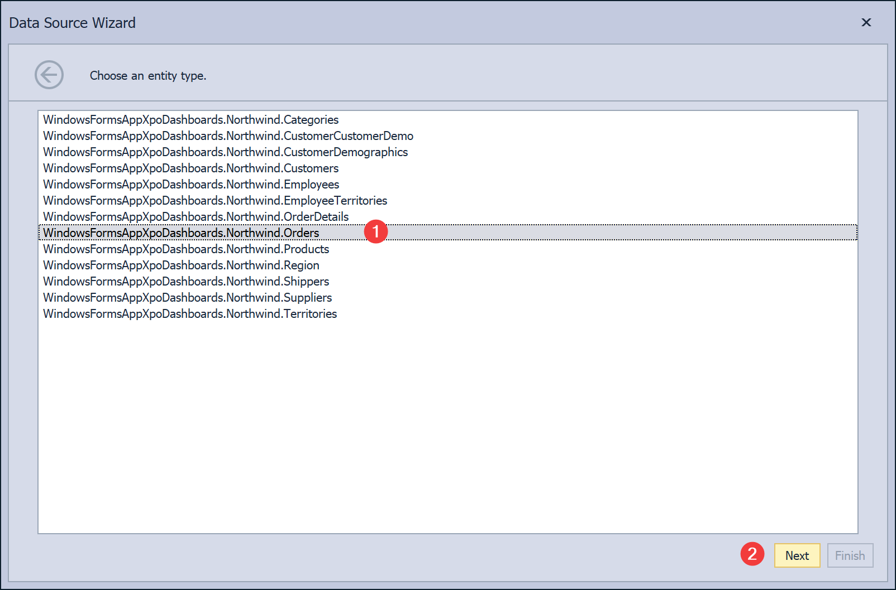
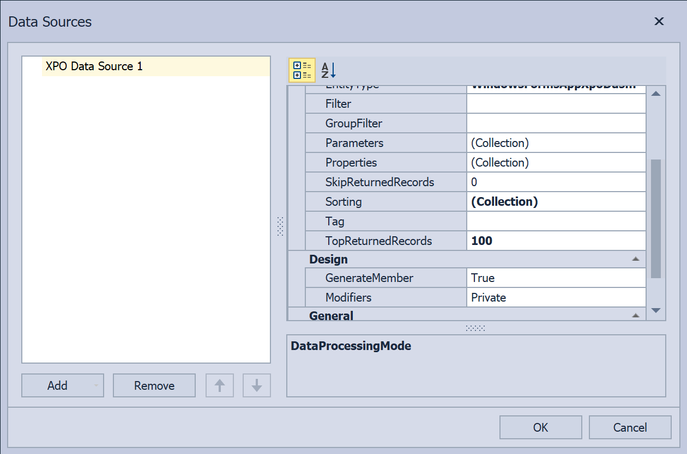

<!-- default badges list -->

<!-- default badges end -->

# XAF - How to Bind a Dashboard to the XPO Data Source at Design-Time

This example creates a dashboard at design-time, binds it to the [DevExpress.DashboardCommon.DashboardXpoDataSource](https://docs.devexpress.com/Dashboard/DevExpress.DashboardCommon.DashboardXpoDataSource?v=19.2) using the Data Source Wizard and displays it in the [DashboardViewer](https://docs.devexpress.com/Dashboard/DevExpress.DashboardWin.DashboardViewer) control.

## Implementation Details

1. 
2. 
3. 

## Files to Review
* [DashboardForm.Designer.cs](./CS/DashboardXpoDemo/DashboardForm.Designer.cs) (VB: [DashboardForm.Designer.vb](./VB/DashboardXpoDemo/DashboardForm.Designer.vb))
* [Dashboard1.Designer.cs](./CS/DashboardXpoDemo/Dashboard1.Designer.cs) (VB: [Dashboard1.Designer.vb](./VB/DashboardXpoDemo/Dashboard1.Designer.vb))
* [DemoDataHelper.cs](./CS/DashboardXpoDemo/DataAccess/DemoDataHelper.cs) (VB: [DemoDataHelper.vb](./VB/DashboardXpoDemo/DataAccess/DemoDataHelper.vb))
* [RevenueAnalysisDataItem.cs](./CS/DashboardXpoDemo/DataAccess/RevenueAnalysisDataItem.cs) (VB: [RevenueAnalysisDataItem.vb](./VB/DashboardXpoDemo/DataAccess/RevenueAnalysisDataItem.vb))
 
## More Examples
* [How to Bind a Dashboard to the XPO Data Source at Runtime](https://github.com/DevExpress-Examples/winforms-dashboard-xpo-data-source).
<!-- feedback -->
## Does this example address your development requirements/objectives?

 

(you will be redirected to DevExpress.com to submit your response)
<!-- feedback end -->
